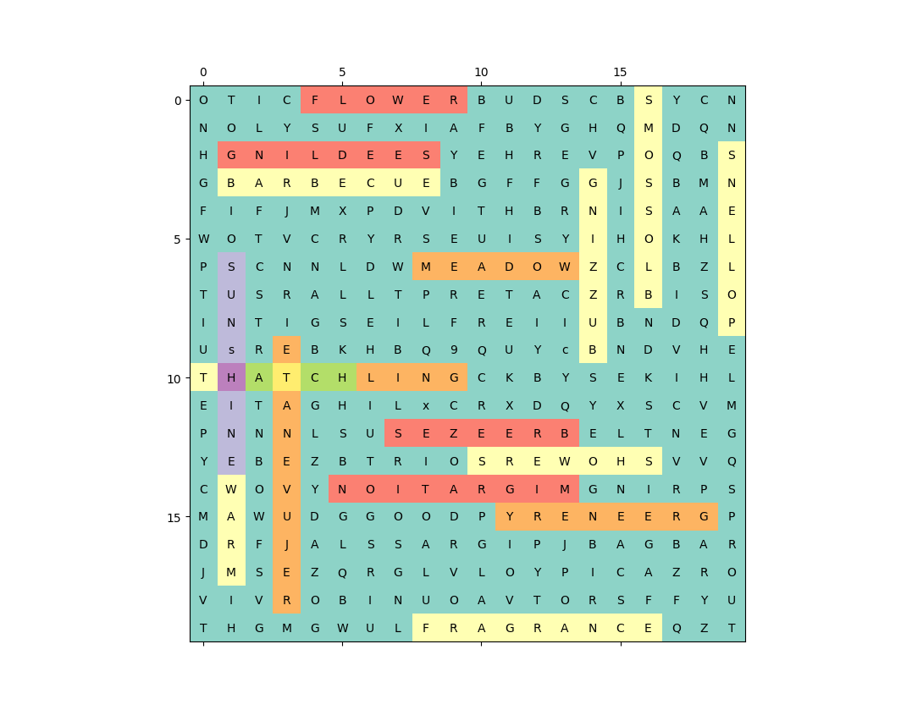

# wordsearch
A simple wordsearch solver.

<p align="center"> 

</p>

### Caveats
Only works on rectangular inputs and English word searches. Modifications necessary to work with UTF-8 text.

## How to use it:
0. Clone the repository.
1. Have Python3 and pip installed
2. `pip3 install -r requirements.txt`

### Text Input
3. If you have a word search in text form, that is, some text that looks like

```
OTICFLOWERBUDSCBSYCN
NOLYSUFXIAFBYGHQMDQN
HGNILDEESYEHREVPOQBS
GBARBECUEBGFFGGJSBMN
FIFJMXPDVITHBRNISAAE
WOTVCRYRSEUISYIHOKHL
PSCNNLDWMEADOWZCLBZL
TUSRALLTPRETACZRBISO
INTIGSEILFREIIUBNDQP
UsREBKHBQ9QUYcBNDVHE
THATCHLINGCKBYSEKIHL
EITAGHILxCRXDQYXSCVM
PNNNLSUSEZEERBELTNEG
YEBEZBTRIOSREWOHSVVQ
CWOVYNOITARGIMGNIRPS
MAWUDGGOODPYRENEERGP
DRFJALSSARGIPJBAGBAR
JMSEZQRGLVLOYPICAZRO
VIVROBINUOAVTORSFFYU
THGMGWULFRAGRANCEQZI
```

then just copy and paste it to `formatted.txt`. Then, skip to step 12.

4. If, instead, you have some badly formatted text, something like
```
O T I C FL  O W E R B U DS  CB  S YCN
NOLYSUF XIAFB YGHQMD QNHGNILDE ESYE  HREVPOQBS
GBAR BEC UEBGFFGGJSBMN FIFJ MXP DVITHB  RN ISAAE
WOTV  CRY RSE UI  SYI  HOKHL
PSCNN LDWM EADO  WZCLB ZL TUSRALLTPR E TA CZRBI SO
INTI  GSE ILFRE IIUBN DQP
UsREB K    HBQ9 QUYcB NDVH
ETHAT  CHL INGC KBYSEKIH
LEITA GHI LxCR XDQYXSCVMPNNNLSU SEZEE  RBELT NE
GYEBEZBT RIOSREWOHS VV
QCWOVY NO ITARGIMGNI RP
SMAWUD G GO   ODPYRENEE RG
PDRFJ A LSSA RGIPJBAGB A
RJM SEZQRGLV   LOYPICAZ R
 O VIVROBINU OAVTORSFF  Y
UTHGMGWULFRAGRANCEQ Z I
```
then, copy your badly formatted text into `input.txt`.

5. Run `python3 format.py charactersperrow`, where `charactersperrow` is the number of characters per row of the true word search. This is assumed to be a positive constant, since this program only works on rectangular word searches.

Then, skip to step 12.

### Image Input
6. Unfortunately, none of the Python OCR libraries seemed to work correctly for this task. So, the alternative is as follows:
7. Take a picture of your word search. Crop it so that it only includes the word search text, no borders, outlines, or any other stray marks.
8. Consider running some image processing to clear up the text.
9. Run the cropped word search image through the ["Try the API" demo](https://cloud.google.com/vision/) on the Google Cloud Vision site.
10. Click on the "Text" tab and copy over the OCR'd text into `input.txt`. Make sure to save this file with ANSI encoding (the script will need slight modifications to read in UTF-8 formatting).
11. Run `python format.py charactersperrow` where `charactersperrow` is the number of characters per row of the true word search. This is assumed to be a positive constant, since this program only works on rectangular word searches.

### All Inputs
12. Verify `formatted.txt` is correct. If this deviates from your true word search, this program is not guaranteed to be correct. Alternatively, don't verify `formatted.txt` matches your word search, hope it's correct, and blindly trust Google Cloud Vision.
13. This program will only find words in the word search that are also contained in the English Dictionary. Any additional words you want found should be added to `addendum.txt`.
14. Run `python3 wordsearch.py`. There are a few flags available:

-  `--min`: sets the minimum number of characters for words you want to find. Defaults to 4. 
-  `--max`: sets the maximum number of characters for words you want to find. Defaults to the maximum side length of the word search.
-  `--common`: Use a dictionary of the 10,000 most common English words instead of the full English dictionary.
-  `--addonly`: Use the list of words in `addendum.txt` as the entire dictionary; ignore `english.txt` and `common.txt`.
-  `--useall`: After `wordsearch.py` finds all the possible words contained in the wordsearch, it will open a GUI and allow you to choose which ones you want highlighted visually. This flag tells the program that you want it to show *all* found words. Thus, this flag hides the word selection GUI and `wordsearch.py` will immediately output the final result. This flag may be helpful when paired with `--addonly`, since you can use `--addonly --useall` after adding the word search's word bank to `addendum.txt` to eliminate all false positives and get near-perfect results instantaneously.

As mentioned above, `python3 wordsearch.py` will find all possible dictionary words of length between `--min` and `--max`, and will then open a GUI to allow you to select which ones you want highlighted. Then, it will output the wordsearch in `matplotlib` form, with the selected words highlighted in different colors.



## Other
If you wish to build a better visualization scheme, note that the first 198 lines of `wordsearch.py` form a complete program which writes all found words to the text file `intermediate/found.txt`. Furthermore, every line in `intermediate/coord.txt` corresponds to the coordinates of the corresponding word in `found.txt`. Every `[x,y]` tuple corresponds to the position of a letter in a found word in the word search grid. If you wish to build a visualizer off this code, these two files provide complete information in a relatively easy-to-parse format.

## Citations
- `common.txt` from [github.com/first20hours](https://github.com/first20hours/google-10000-english).
- `english.txt` from [gwicks.net](http://www.gwicks.net/dictionaries.htm).
- Example word search shown in `output.png` from [here](https://www.wianc.org/nature-puzzles/2019/2/13/think-spring-word-search).
